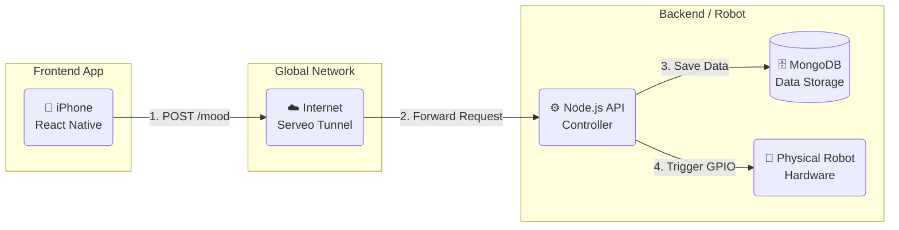

# System Architecture Diagram Concept

Use this guide to build your diagram in Canva.

## 1. The Structure (Left to Right)

You need **3 main zones**:

1.  **Client Zone** (The User)
2.  **Connection Zone** (The Internet/Tunnel)
3.  **Server Zone** (The Robot/Raspberry Pi)

---

## 2. Elements to Search in Canva

*   **iPhone / Smartphone**: Represents the Frontend App.
*   **Cloud / Globe**: Represents the Internet and the Serveo/Localtunnel service.
*   **Server / Chip / Raspberry Pi**: Represents the Backend.
*   **Database / Cylinder**: Represents MongoDB.
*   **Robot / Toy**: Represents the physical Robot.

---

## 3. The Flow (Arrows)

Draw arrows connecting them in this order:

1.  **Smartphone** ➡️ **Cloud**
    *   *Label:* "HTTPS Request (JSON)"
    *   *Meaning:* User clicks "Mood Check-in"

2.  **Cloud** ➡️ **Raspberry Pi (Node.js)**
    *   *Label:* "Secure Tunnel (SSH)"
    *   *Meaning:* Data travels safely through the tunnel

3.  **Raspberry Pi** ➡️ **Database**
    *   *Label:* "Store Data"
    *   *Meaning:* Mongoose saves the mood

4.  **Raspberry Pi** ➡️ **Robot**
    *   *Label:* "Hardware Signal (GPIO)"
    *   *Meaning:* LED turns Yellow (Joyful)

---

## 4. Visual Draft (Mermaid)

